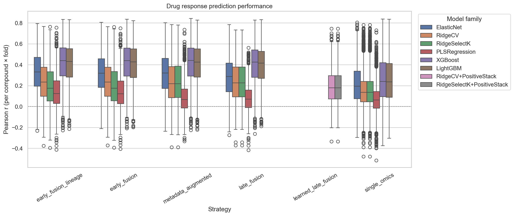

# Mechanism-Aware Drug Response Prediction with Multi-Omics Data

## About the project

Cancer cell lines respond differently because of their molecular characteristics, and multi-omics data provide complementary information for studying these differences.

This project develops a mechanism-aware prediction pipeline using CTRPv2 drug response and cancer cell-line omics. It compares single-omics and integrated strategies, evaluates AAC prediction, and uses SHAP and pathway analysis to identify molecular drivers across drug mechanism-of-action classes.

The project asks

> Which molecular data types (gene expression, mutations, DNA methylation, copy-number variation, and proteomics) are most predictive of cancer drug response, and does their relative importance differ across drug mechanism-of-action (MOA) classes?

## Cohort ablation

The cohort ablation compared omics-layer availability and usable cohort size, results are shown below.

| Cohort | Cell lines | Ridge Pearson | XGBoost Pearson |
| --- | ---: | ---: | ---: |
| Five omics | 389 | 0.560 | 0.535 |
| Four omics without proteomics | 508 | 0.586 | 0.567 |
| Three omics without proteomics or methylation | 574 | 0.604 | 0.596 |

These values are mean CV Pearson correlations from the same 12-compound evaluation. Ridge or RidgeSelectK outperformed XGBoost at each cohort size, and expression-only Ridge remained the best configuration. As the omics set and cohort size changed together, the comparison does not isolate the effect of dropping a layer. These diagnostic results are not directly comparable with the full 426 compound results below.

## Final model result comparison

The table below provides the top ten configurations from the full 426 compound run. Metrics are averaged across 2,130 compound-fold evaluations (426 compounds x 5 folds).

| Rank | Model | Strategy | Features | Pearson | Spearman | R-squared | RMSE |
| ---: | --- | --- | --- | ---: | ---: | ---: | ---: |
| 1 | XGBoost | Early fusion | Multi-omics | **0.4175** | **0.3700** | **0.1800** | **0.0855** |
| 2 | XGBoost | Early fusion + lineage | Multi-omics + lineage | 0.4174 | 0.3693 | 0.1798 | 0.0855 |
| 3 | XGBoost | Metadata augmented | Expression + lineage | 0.4174 | 0.3694 | 0.1789 | 0.0856 |
| 4 | XGBoost | Single omics | Expression | 0.4163 | 0.3683 | 0.1778 | 0.0857 |
| 5 | LightGBM | Early fusion + lineage | Multi-omics + lineage | 0.4087 | 0.3615 | 0.1727 | 0.0860 |
| 6 | LightGBM | Early fusion | Multi-omics | 0.4085 | 0.3612 | 0.1723 | 0.0861 |
| 7 | LightGBM | Single omics | Expression | 0.4054 | 0.3576 | 0.1690 | 0.0863 |
| 8 | LightGBM | Metadata augmented | Expression + lineage | 0.4052 | 0.3579 | 0.1691 | 0.0863 |
| 9 | XGBoost | Late fusion | Expression + mutations + CNV | 0.4016 | 0.3507 | 0.1397 | 0.0885 |
| 10 | LightGBM | Late fusion | Expression + mutations + CNV | 0.3924 | 0.3418 | 0.1320 | 0.0889 |

### Result plot



The plot shows compound fold Pearson correlations for 426 compounds across the modeling strategies after fold-safe batch correction. XGBoost and LightGBM generally performed better than the linear models for the fusion strategies, while the wide distributions show variation between compounds. XGBoost with early multi-omics fusion achieved the best overall result (mean Pearson = 0.4175).

## Data sources

- **DepMap Public 26Q1** - cell-line metadata, gene expression, mutations, and copy-number variation.
- **CCLE and Cell Model Passports** - DNA methylation and proteomics used in the cohort-ablation experiments.
- **PharmacoDB CTRPv2** - compound-level AAC drug-response measurements and compound identifiers.
- **ChEMBL, PubChem, and the PRISM Repurposing Hub** - compound mechanism-of-action annotations.
- **Enrichr libraries** - KEGG, Gene Ontology, Reactome, and MSigDB Hallmark gene sets used for pathway enrichment.

## Workflow

### 1. Clone the repository

```bash
git clone https://github.com/Hrishikesh332/Multi-Omics-Mechanism-Modelling-AAC.git
cd Multi-Omics-Mechanism-Modelling-AAC
```

### 2. Create an environment


```bash
python3 -m venv .venv
source .venv/bin/activate
python -m pip install jupyter pandas numpy scipy scikit-learn umap-learn \
  matplotlib seaborn requests pyarrow tqdm upsetplot joblib \
  xgboost lightgbm shap gseapy
```

### 3. Run the workflow

Run the notebooks in this order:

1. `01_data_prep_eda.ipynb` prepares and explores the multi-omics and drug-response data.
2. `02_model_development_final.ipynb` trains and evaluates the prediction models.
3. `03_shap_moa_analysis_v2_426.ipynb` calculates SHAP importance and compares results across MOA classes.
4. `04_kegg_go_enrichment.ipynb` performs pathway enrichment on SHAP-derived genes.

The supporting cohort-ablation notebooks are in `02_cohort_ablations_model_dev/` and are not required for the final workflow.

The first two cells of `03_shap_moa_analysis_v2_426.ipynb` mount and copy data from Google Drive; skip them when running locally.

## Modeling design

- **Target -** compound-specific AAC values.
- **Eligibility -** at least 250 observed cell lines and AAC standard deviation of at least 0.04.
- **Final omics layers -** expression, mutations, and CNV.
- **Integration -** single-omics, early fusion, simple late fusion, learned late fusion, and lineage augmentation.
- **Models -** ElasticNet, RidgeCV, RidgeSelectK, PLSRegression, XGBoost, and LightGBM.
- **Evaluation -** Pearson correlation, Spearman correlation, RMSE, MAE, and R-squared.
- **Validation -** five-fold cross-validation with scaling and batch correction fitted only on training folds.
- **Interpretation -** fold-averaged SHAP values summarized by feature, omics layer, compound, and MOA class.

Random seeds are fixed to 42 where supported. Feature scaling, selection, and batch correction are applied within training folds to reduce information leakage.

## Optional W&B tracking

Weights & Biases logging is disabled by default.

```bash
python -m pip install wandb
wandb login
```

Then update the configuration in `02_model_development_final.ipynb`:

```python
USE_WANDB = True
WANDB_PROJECT = "multiomics-drug-response-v4"
WANDB_ENTITY = None
WANDB_MODE = "online"
```

